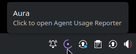
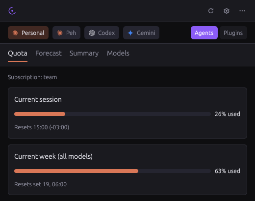
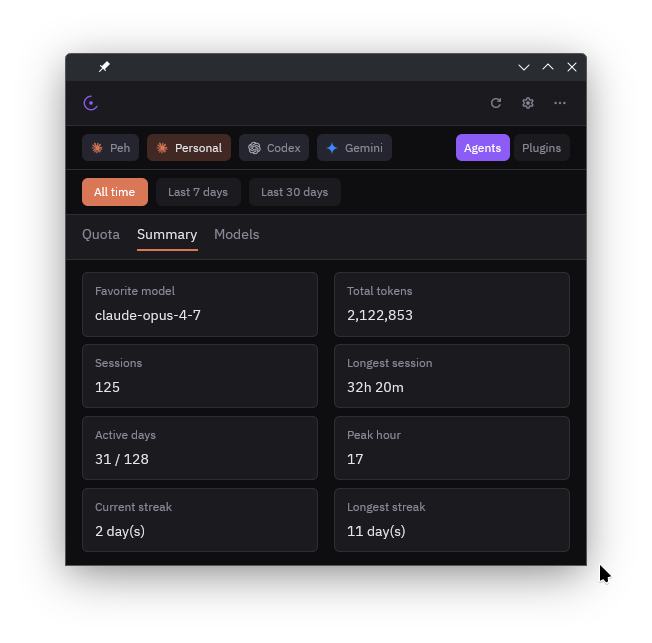
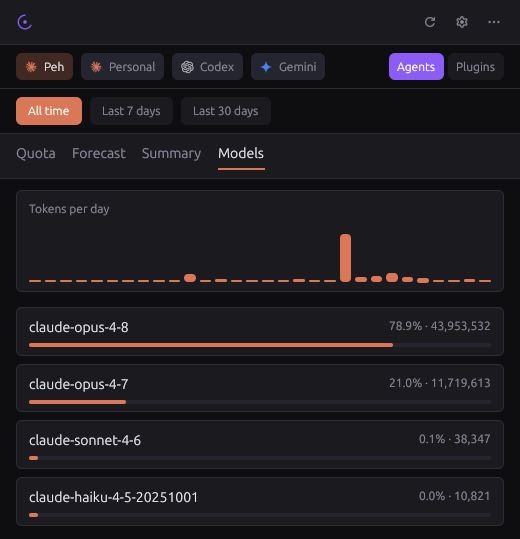
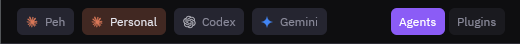
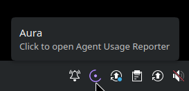
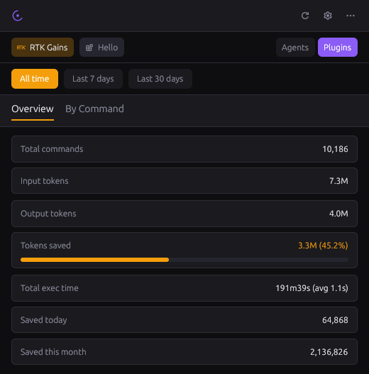

<h1 align="center">Aura</h1>

<p align="center">
  
</p>

<p align="center">
  <strong>Agent Usage Reporter &amp; Analyzer</strong><br/>
  <em>Know exactly what your AI agents are spending.</em>
</p>

<hr/>

Aura is a lightweight Rust **system-tray indicator** — sits next to wifi
and volume — that gives you instant visibility into AI agent usage: tokens
consumed, subscription quota windows, estimated costs, and custom
optimizer metrics via a plugin system. Click the icon, see your usage,
click again to dismiss.

## Contents

- [Screenshots](#screenshots)
- [Why Aura?](#why-aura)
- [Features](#features)
- [Plugins](#plugins)
- [Configuration](#configuration)
- [Installation](#installation)
  - [Making the tray icon always visible](#making-the-tray-icon-always-visible)
  - [Modal placement on Wayland](#modal-placement-on-wayland)
  - [System dependencies](#system-dependencies-linux)
  - [Install from GitHub Releases](#install-from-github-releases)
  - [Build from source](#build-from-source)
  - [Common commands](#common-commands)
  - [Updating](#updating)
  - [Uninstall](#uninstall)
- [Compatibility](#compatibility)
- [Under the hood](#under-the-hood)
- [Roadmap](#roadmap)
- [Sponsor](#sponsor)
- [Contributing](#contributing)
- [License](#license)

## Screenshots

<!--
Add real screenshots to assets/screenshots/. The captions below double as
shot guidance — capture exactly what each one describes. Filenames are
referenced from the  src so you can drop PNGs in without touching
the README.
-->

<p align="center">
  
  <br/><em>The Aura indicator lives next to wifi / volume — left-click to open.</em>
</p>

<p align="center">
  
  <br/><em>Quota tab — live subscription windows from Claude's API.</em>
</p>

<p align="center">
  
  <br/><em>Summary tab — at-a-glance usage stats for the selected period.</em>
</p>

<p align="center">
  
  <br/><em>Models tab — which models actually ate your tokens.</em>
</p>

<p align="center">
  
  <br/><em>One click to switch agent profiles — last selection is persisted.</em>
</p>

<p align="center">
  
  <br/><em>Right-click for explicit Show / Quit.</em>
</p>

<p align="center">
  
  <br/><em>RTK Gains plugin tab — third-party metrics rendered inline.</em>
</p>

## Why Aura?

Modern development workflows run on AI agents. But usage is invisible
until the bill arrives. Aura surfaces that data where you already live —
your system tray — without switching context, opening a browser, or
running a CLI command.

## Features

- **Multi-agent support** — Claude Code, Codex, and Gemini out of the box; custom command agents on the roadmap.
- **Agent profiles** — configure multiple instances of the same agent (e.g. personal vs. enterprise workspaces) and toggle between them; last selection is persisted across sessions.
- **Plugin system** — extend Aura with custom metrics panels; anyone can author a plugin. First-party plugins (incl. RTK Gains for [RTK](https://github.com/rtk) token-savings) are installed separately.
- **Single-click activation** — left-click the tray icon to open / close the modal; right-click for Show / Quit.
- **Tray-native** — uses [`ksni`](https://github.com/iovxw/ksni) on Linux for direct StatusNotifierItem (Plasma / GNOME / sway / etc.) and `tray-icon` on macOS / Windows for AppKit / Win32 menu-bar integration.

## Plugins

Plugins are stand-alone executables that publish JSON panels into the
modal. **None ship with the core install** — Aura itself stays minimal.
Plugins are installed separately, either by `aura plugin add` or by
dropping a binary into the user plugins dir
(`~/.config/aura/plugins/` on Linux).

First-party plugins (built from this repo's `plugins/` directory):

| Plugin                                          | Description                                                                                                        |
| ----------------------------------------------- | ------------------------------------------------------------------------------------------------------------------ |
| **[RTK Gains](plugins/rtk-gains/README.md)**    | Shows tokens saved by the Rust Token Killer (RTK) optimizer — how much you spent vs. how much you would have spent |
| **[Hello](plugins/hello/)** _(reference only)_  | Minimal example showing the JSON contract for plugin authors                                                       |

Each plugin's README explains how to build and install it. The
`aura plugin` CLI wraps the common workflows:

```bash
aura plugin add ./target/release/aura-plugin-rtk    # install a built plugin
aura plugin list                                     # see what's wired up
aura plugin remove "RTK Gains"                       # uninstall by display name
aura plugin run "RTK Gains" --period 7d              # debug-print panel JSON
```

Anything in `~/.config/aura/plugins/` is auto-discovered at modal open —
no `config.toml` edit required. To pin the order of the pill row, set
`[display] plugin_order = ["Hello", "RTK Gains"]` in `config.toml`
(see [`docs/configuration.md`](docs/configuration.md)). See
[`docs/plugin-authoring.md`](docs/plugin-authoring.md) for the full wire
contract and authoring checklist.

## CLI

Running `aura` with no arguments launches the tray; subcommands run
headless so they can be scripted. Highlights:

```bash
aura doctor                              # paths + agent detection + plugin discovery
aura usage --period 7d --format json     # token snapshot for the active profile
aura quota --format json                 # subscription rate-limit windows
aura state set-profile "Codex"           # switch the active profile from the shell
aura completions zsh > ~/.zfunc/_aura    # shell completions
```

Every read command takes `--format text|json`. The legacy spelling
`aura setup-config` still works (hidden alias for `aura config setup`).
See [`docs/cli.md`](docs/cli.md) for the full reference.

## Configuration

Aura is configured via a single TOML file at the OS-standard config location:

| Platform | Config path                                      |
| -------- | ------------------------------------------------ |
| Linux    | `~/.config/aura/config.toml`                     |
| macOS    | `~/Library/Application Support/aura/config.toml` |
| Windows  | `%APPDATA%\aura\config.toml`                     |

Define as many profiles as you need:

```toml
[[agents]]
name = "Claude Code (Personal)"
kind = "claude-code"
config_path = "~/.claude"

[[agents]]
name = "Claude Code (Enterprise)"
kind = "claude-code"
config_path = "~/.claude-enterprise"

[[agents]]
name = "Codex"
kind = "codex"

[[agents]]
name = "Gemini"
kind = "gemini"

# Optional display tweaks. All keys are optional; defaults shown.
[display]
default_period         = "today"      # "today" | "this_month" | "all_time"
anchor                 = "auto"       # "auto" | "top" | "bottom" | "left" | "right"
dismiss_on_focus_loss  = true         # set false to make the modal sticky
show_in_app_switcher   = false        # show Aura in Cmd+Tab / Alt+Tab / WM switcher
# plugin_order         = ["Hello", "RTK Gains"]
```

`config.toml` is hot-reloaded — left-clicking the tray icon and the
modal's refresh button both re-read the file, so edits take effect
without restarting Aura. See
[`docs/configuration.md`](docs/configuration.md) for the full schema.

## Themes

Aura's color tokens are user-customizable via a sibling file:

| Platform | Theme path                                      |
| -------- | ----------------------------------------------- |
| Linux    | `~/.config/aura/theme.toml`                     |
| macOS    | `~/Library/Application Support/aura/theme.toml` |
| Windows  | `%APPDATA%\aura\theme.toml`                     |

Every key is optional — anything you don't set falls back to the built-in
default. Click **Themes** in the more menu (•••) and Aura will create the file
seeded with the current defaults, then open it in your editor:

```toml
[colors]
bg     = "#0e0e10"
accent = "#8b5cf6"
error  = "#ff6b6b"

[typography]
font_family = "JetBrains Mono"

# Per-agent overrides (quote names with spaces or parentheses).
[agents."Claude Code (Personal)"]
accent = "#d97757"
```

For an agent's accent color, the first match wins: `[agents."<name>"].accent`
in `theme.toml` → `[[agents]] color = "..."` in `config.toml` → the agent's
per-kind brand default. A WCAG-luminance fallback then swaps any color that
would wash out against the dark surface (`> 0.85` relative luminance) for
`colors.agent_fallback`.

The header refresh button reloads `theme.toml` alongside `config.toml`, so
edits take effect without restarting Aura. The full schema lives in
[`.design/customization.md`](.design/customization.md).

## Installation

Aura is a **system-tray indicator** — like wifi or volume in your panel.
The installer wires up autostart by default so the icon is present the
moment you log in:

| Platform    | What gets installed                                                                                          |
| ----------- | ------------------------------------------------------------------------------------------------------------ |
| **Linux**   | `~/.local/bin/aura` + a systemd user service (enabled & started) + an XDG `.desktop` entry for the app menu  |
| **macOS**   | `Aura.app` in `/Applications` + a launchd LaunchAgent (loaded now + at every login)                          |
| **Windows** | `aura.exe` in `%LOCALAPPDATA%\Programs\Aura` + a Startup-folder shortcut (autostart) + a Start Menu shortcut |

**Left-click** the tray icon to open Aura's modal; left-click again to
close. **Right-click** for an explicit menu with **Show Aura** and
**Quit Aura**. `just stop` / `systemctl --user stop aura` (Linux) and
`just stop-windows` (Windows) are equivalent CLI exits.

Grab a prebuilt release archive (next section) or build from source with
Cargo (Rust 1.80+).

### Making the tray icon always visible

On Plasma / GNOME the icon may land in the "hidden" overflow group first.
Promote it so it sits permanently next to wifi/volume:

- **KDE Plasma** — right-click the system tray → **Configure System Tray → Entries** → find **Aura** → set **Visibility: Always shown**.
- **GNOME** — install the _AppIndicator and KStatusNotifierItem Support_ extension if you don't have it; aura then appears in the panel by default.
- **macOS** — the menu-bar icon is always visible; nothing to configure.
- **Windows** — click the `^` overflow arrow in the tray, drag the Aura icon to the always-visible area.

### Modal placement on Wayland

On X11, Windows, and macOS, the modal opens in the bottom-right corner
(where the tray icon usually lives). On Wayland (KWin, Mutter, sway)
the compositor decides where windows go — the Wayland protocol forbids
clients from positioning regular toplevel surfaces — so KWin will
typically center the modal instead. The modal's height is still capped
so it never overlaps a bottom taskbar.

If you'd like exact bottom-right placement on KDE Plasma / Wayland,
add a KWin window rule:

1. **System Settings → Window Management → Window Rules → Add New**.
2. **Window class** (substring match): `aura`.
3. Add property **Position** → set the value to e.g. `[screen_width - 540, screen_height - panel_height - 660]` (Force = Apply Initially).
4. Apply. The next time Aura's modal opens it will land where you set it.

### System dependencies (Linux)

```bash
# Debian/Ubuntu
sudo apt install build-essential pkg-config libgtk-3-dev \
                 libxkbcommon-x11-dev libxcb1-dev libxcb-render0-dev \
                 libxcb-shape0-dev libxcb-xfixes0-dev libfontconfig-dev
```

The runtime dependencies (`libgtk-3-0`, `libxkbcommon-x11-0`, `libxcb1`,
`libxcb-render0`, `libxcb-shape0`, `libxcb-xfixes0`, `libfontconfig1`) are also
needed at install-from-release time — the `-dev` packages above cover them.

### System dependencies (macOS)

```bash
xcode-select --install                  # AppKit / linker
brew install librsvg                    # only needed if you want a real .icns
```

The release tarball is unsigned, so on first launch macOS will quarantine it.
Either right-click `Aura.app` → **Open** and confirm, or strip the flag:

```bash
xattr -dr com.apple.quarantine /Applications/Aura.app
```

Claude Code OAuth tokens are stored in the macOS Keychain on Darwin (service
`Claude Code-credentials`); Aura reads them from there automatically. If you
get a "Keychain read failed" warning, run Claude Code at least once to
populate the entry, then restart Aura.

### System dependencies (Windows)

No system packages required — the MSVC C runtime ships with Windows. To
build from source you'll need:

```powershell
# Install Rust (https://rustup.rs) and the MSVC build tools
# (Visual Studio "Desktop development with C++" workload or VS Build Tools).
rustup target add x86_64-pc-windows-msvc      # default on Windows hosts
```

On Windows Claude Code stores OAuth tokens in **Credential Manager** (target
`Claude Code-credentials`); Aura reads them from there automatically, falling
back to `%USERPROFILE%\.claude\.credentials.json` for legacy installs. If you
get a "Credential Manager read failed" warning, run Claude Code at least once
to populate the entry, then restart Aura.

### Install from GitHub Releases

Published releases include tarballs (Linux/macOS) and a zip (Windows)
containing the `aura` binary plus the platform autostart artifact.
Plugins (incl. RTK Gains) are shipped as separate downloads and
installed with `aura plugin add`:

- Linux x86_64 (gnu) — `x86_64-unknown-linux-gnu`
- Linux x86_64 (musl) — `x86_64-unknown-linux-musl`
- Linux aarch64 (gnu) — `aarch64-unknown-linux-gnu`
- macOS Intel — `x86_64-apple-darwin` (ships `Aura.app` + `com.aura.agent-usage.plist`)
- macOS Apple Silicon — `aarch64-apple-darwin`
- Windows x86_64 — `x86_64-pc-windows-msvc` (ships `aura.exe` + `install.ps1`)
- Windows aarch64 — `aarch64-pc-windows-msvc` (experimental)

> Note: the musl Linux artifact and the aarch64 Windows artifact are still
> experimental. macOS archives are built and signed best-effort — unsigned
> bundles will be quarantined by Gatekeeper; see the macOS deps section above.
> Windows binaries are unsigned: SmartScreen may prompt on first run.

Run the installer — it auto-detects your host, downloads the matching archive,
verifies its checksum, and wires up autostart:

```bash
# Linux / macOS
curl -fsSL https://raw.githubusercontent.com/Rfluid/aura/main/install.sh | bash
```

```powershell
# Windows (PowerShell)
iex (irm https://raw.githubusercontent.com/Rfluid/aura/main/scripts/install.ps1)
```

Make sure `~/.local/bin` (Linux/macOS) or `%LOCALAPPDATA%\Programs\Aura`
(Windows) is on `PATH`.

### Build from source

#### One-shot install

```bash
./install.sh        # auto-detects Linux/macOS and wires up autostart
```

```powershell
# Windows
powershell -ExecutionPolicy Bypass -File .\scripts\install.ps1
```

Or, with [`just`](https://github.com/casey/just):

```bash
just install                 # build + install + autostart (Linux/macOS)
```

```powershell
just install-windows         # build + install + autostart (Windows)
```

#### Manual (Linux)

```bash
cargo build --release -p aura
install -Dm755 target/release/aura ~/.local/bin/aura

# App-menu entry + icon (the tray icon itself is delivered inline by
# Aura over D-Bus, but the .desktop file lets the app menu find Aura).
sed "s|AURA_EXEC|$HOME/.local/bin/aura|" packaging/aura.desktop \
    > ~/.local/share/applications/aura.desktop
install -Dm644 packaging/aura.svg \
    ~/.local/share/icons/hicolor/scalable/apps/aura.svg
update-desktop-database ~/.local/share/applications 2>/dev/null || true
gtk-update-icon-cache -f -t ~/.local/share/icons/hicolor 2>/dev/null || true

# Autostart at every login via a systemd user service.
install -Dm644 packaging/aura.service ~/.config/systemd/user/aura.service
systemctl --user daemon-reload
systemctl --user enable --now aura
```

#### Manual (macOS)

```bash
cargo build --release -p aura
install -m 755 target/release/aura ~/.local/bin/aura

./scripts/build-macos-app.sh target/release/aura target/release
cp -R target/release/Aura.app /Applications/Aura.app

# Autostart at every login via a launchd LaunchAgent.
install -m 644 packaging/com.aura.agent-usage.plist \
    ~/Library/LaunchAgents/com.aura.agent-usage.plist
launchctl bootstrap "gui/$(id -u)" \
    ~/Library/LaunchAgents/com.aura.agent-usage.plist
```

#### Manual (Windows)

```powershell
cargo build --release -p aura

$dst = Join-Path $env:LOCALAPPDATA 'Programs\Aura'
New-Item -ItemType Directory -Force -Path $dst | Out-Null
Copy-Item -Force target\release\aura.exe "$dst\aura.exe"

# Startup-folder shortcut (autostart at sign-in, minimised to tray).
$wsh = New-Object -ComObject WScript.Shell
$lnk = $wsh.CreateShortcut((Join-Path ([Environment]::GetFolderPath('Startup')) 'Aura.lnk'))
$lnk.TargetPath       = "$dst\aura.exe"
$lnk.WorkingDirectory = $dst
$lnk.WindowStyle      = 7
$lnk.Save()
```

### Common commands

| Command                                     | What it does                                                            |
| ------------------------------------------- | ----------------------------------------------------------------------- |
| `just run`                                  | Launch Aura (debug build) without installing                            |
| `just start` / `just stop` / `just status`  | Start, stop, or check the running `aura` process (Linux/macOS)          |
| `just start-windows` / `just stop-windows`  | Same, for Windows                                                       |
| `just uninstall` / `just uninstall-windows` | Remove binaries + autostart artifacts + launcher (keeps config & state) |

`just uninstall` also clears the KDE window rule and any opt-in
LaunchAgent / Startup-folder shortcut — you don't have to remember
which install path you took.

### Updating

Re-running `./install.sh` always writes the new binary, but the **running
process** is only replaced automatically on macOS (`launchctl kickstart -k`)
and Windows (`Stop-Process` before copy). On Linux the installer calls
`systemctl --user enable --now aura`, which is a no-op when the unit is
already running — so the tray keeps serving the old build until you restart
it explicitly.

```bash
# Linux — after ./install.sh, swap the old binary in:
systemctl --user restart aura

# macOS / Windows — nothing extra; ./install.sh (or scripts/install.ps1)
# already restarted the process for you.
```

If you opted out of the systemd autostart (or `systemctl --user restart aura`
reports "no such unit"), kill the stray tray process directly:

```bash
pkill -x aura && ~/.local/bin/aura >/dev/null 2>&1 &
disown
```

### Uninstall

```bash
# Linux / macOS
just uninstall            # disables autostart, kills the running tray,
                          # removes binaries + launcher + systemd unit
                          # (Linux) / LaunchAgent + Aura.app (macOS),
                          # and clears the KDE keepalive window rule
```

```powershell
# Windows (PowerShell)
just uninstall-windows    # stops aura.exe and removes the binary +
                          # Start Menu / Startup-folder shortcuts
```

Your **config and state are preserved** (`~/.config/aura/config.toml` and
`~/.local/share/aura/state.json` on Linux; the equivalent OS-specific dirs
on macOS / Windows). Delete those by hand if you want a full wipe.

## Compatibility

Aura ships and is verified end-to-end on Linux (KDE Plasma 6 / Wayland),
macOS 12+, and Windows 10/11 — tray icon, modal, autostart, single-click
activation, focus-loss dismiss, and the installer all work on each. The
table below also lists Linux compositors that share the same
StatusNotifierItem code path but haven't been explicitly verified —
please open an issue if anything goes wrong, with the desktop env /
compositor version.

| Platform          | Desktop / Compositor          | Tray protocol                                                                                                     | Status                                                                                               |
| ----------------- | ----------------------------- | ----------------------------------------------------------------------------------------------------------------- | ---------------------------------------------------------------------------------------------------- |
| Linux             | KDE Plasma 6 (Wayland / KWin) | StatusNotifierItem (ksni)                                                                                         | ✅ Tested — install.sh auto-installs the KWin "skip taskbar" rule for the keepalive                  |
| Linux             | KDE Plasma 6 (X11)            | StatusNotifierItem (ksni)                                                                                         | ⚠️ Untested — same code, position is honored natively so modal opens bottom-right                    |
| Linux             | KDE Plasma 5                  | StatusNotifierItem (ksni)                                                                                         | ⚠️ Untested — Plasma 5's `plasmashellrc` panel-thickness lookup may differ                           |
| Linux             | GNOME 45+ (Wayland / Mutter)  | StatusNotifierItem via [AppIndicator extension](https://extensions.gnome.org/extension/615/appindicator-support/) | ⚠️ Untested — extension is required for the icon to appear                                           |
| Linux             | sway / Hyprland / wlroots     | StatusNotifierItem                                                                                                | ⚠️ Untested — depends on a status-bar that honours SNI (Waybar etc.)                                 |
| Linux             | XFCE / Cinnamon / MATE        | StatusNotifierItem                                                                                                | ⚠️ Untested — these spec'ed StatusNotifierItem support, should work                                  |
| **macOS 12+**     | —                             | AppKit menu-bar item                                                                                              | ✅ Tested — `tray-icon`'s native AppKit backend, single-click activation, launchd autostart          |
| **Windows 10/11** | —                             | Shell_NotifyIcon                                                                                                  | ✅ Tested — `tray-icon`'s native Win32 backend, single-click activation, Startup-folder autostart    |

Pull requests confirming or fixing any of the ⚠️ rows are welcome — see
[Under the hood](#under-the-hood) for the relevant code paths.

## Under the hood

A few decisions worth knowing about if you're contributing or debugging:

### Linux tray backend: ksni, not libayatana-appindicator

We use [`ksni`](https://github.com/iovxw/ksni) — a direct
StatusNotifierItem D-Bus implementation — instead of the more common
`tray-icon` crate with its `gtk` (libayatana-appindicator) feature.
AppIndicator collapses every click into "show context menu" and forces a
GTK main loop on its own thread; ksni surfaces `Activate()` as a callback
(single click → action) and runs its own lightweight D-Bus loop. The
single-click open / close UX you see is only possible because of that.

### The keepalive window

GPUI 0.2's Wayland event loop exits the moment `state.windows.is_empty()`
([source](https://github.com/zed-industries/zed/blob/main/crates/gpui/src/platform/linux/wayland/client.rs)).
If aura only had the modal, closing it would kill the tray process. So
we open a tiny `aura-keepalive` window on startup and never close it.
KDE renders it as a real toplevel (Wayland's `show: false` is ignored),
so:

- it opens off-screen at `(-9999, -9999)` and is minimised immediately;
- it registers `on_window_should_close → false` so the WM's "close
  window" action becomes a no-op (the tray can't be killed by a stray
  click in the task manager);
- `install.sh` writes a KWin rule (`~/.config/kwinrulesrc`) that forces
  Skip Taskbar / Skip Pager / Skip Switcher on its `app_id`.

On GNOME / sway / etc. the keepalive may still appear in the
task-bar / overview. Patches to add equivalent rules per WM are
welcome.

### Modal placement on Wayland

Wayland's `xdg_toplevel` protocol [forbids client-side
positioning](https://gitlab.freedesktop.org/wayland/wayland-protocols/-/blob/main/stable/xdg-shell/xdg-shell.xml)
— the compositor decides where windows go. GPUI 0.2 always uses
`xdg_toplevel` (never `xdg_popup`), so KWin / Mutter / sway ignore our
requested origin and typically center the modal. On X11, Windows, and
macOS, our requested bottom-right corner is honored natively.

To pin the modal to a specific position on KDE / Wayland, add a window
rule under **System Settings → Window Management → Window Rules** with
**Window class** substring match `aura` and a forced **Position**.

### Why we cap the modal height (and how)

Some pages produce more content than fits in the initial 640 px modal.
GPUI's auto-resize lets the window grow downward to fit — and would
otherwise overlap a bottom taskbar. On KDE Plasma we parse
`~/.config/plasmashellrc` to get the exact panel thickness and cap the
resize at `display_bottom − thickness`. On everything else we use a
120 px blind reserve, which clears all common taskbar / Dock heights at
a small cost in usable space.

## Roadmap

Shipped

- [x] Claude Code usage integration (`~/.claude` JSONL scan, OAuth via Keychain / Credential Manager)
- [x] Codex usage integration (`~/.codex` session scan)
- [x] Gemini usage integration (`~/.gemini` session scan)
- [x] Multi-profile config + persisted selection across sessions
- [x] Plugin runner (subprocess + JSON IPC); RTK Gains shipped as opt-in plugin
- [x] Linux support (systemd user service · ksni StatusNotifierItem · KDE / GNOME / sway compatible)
- [x] macOS support (Apple Silicon + Intel; menu-bar `Aura.app` + launchd autostart)
- [x] Windows support (x86_64 + aarch64; Shell_NotifyIcon tray + Startup-folder autostart)
- [x] Per-DE polish: auto-installed KWin rule on KDE to hide the keepalive surface

Next up

- [x] Plugin authoring guide + example plugin (see `docs/plugin-authoring.md` and `plugins/hello/`)
- [x] Plugin discovery (local scan of `~/.config/aura/plugins/`) + `aura plugin add|list|remove`
- [ ] Custom command agents (BYOA — Bring Your Own Agent via a shell command)
- [ ] Cost alerts / budget warnings
- [ ] Historical usage charts (daily / weekly trend in the modal)
- [ ] Per-project usage breakdown (where agents expose project-scoped data)

Later

- [ ] Plugin registry (`aura plugin install <name>`)
- [ ] Signed macOS bundles + notarization
- [ ] Signed Windows binaries (SmartScreen-clean)

## Sponsor

See [SPONSOR.md](./SPONSOR.md) for ways to support Aura.

## Contributing

See [CONTRIBUTING.md](./CONTRIBUTING.md) for local setup, development workflow,
and pull request guidance.

## License

MIT
